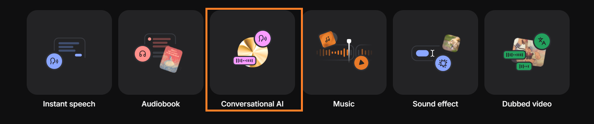
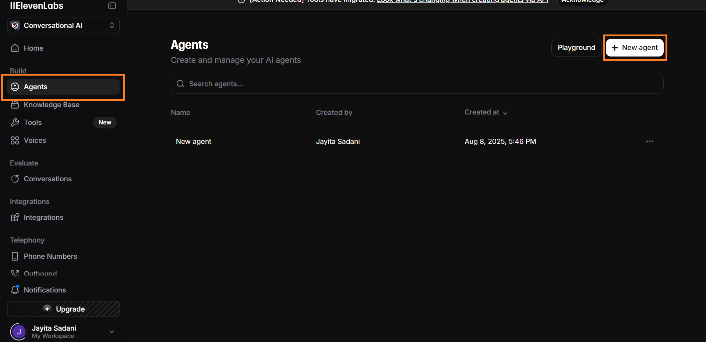
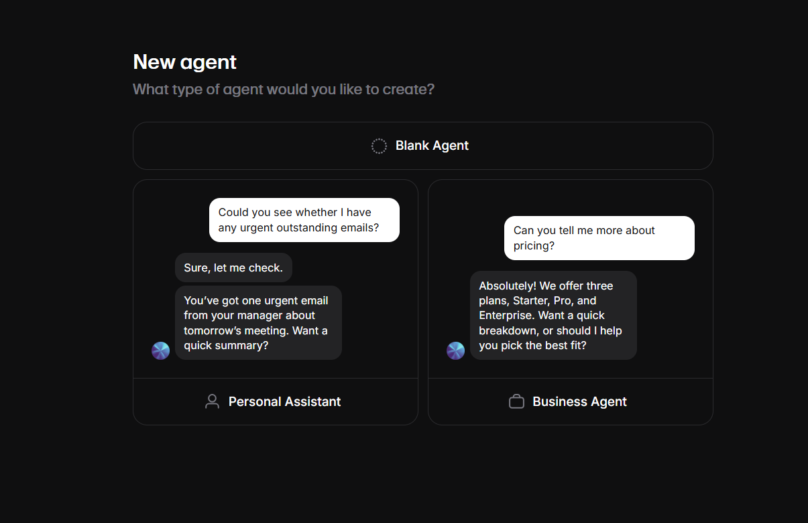
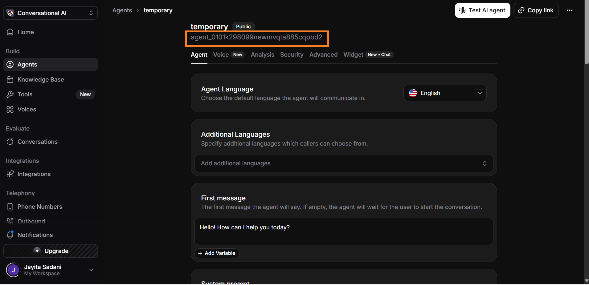
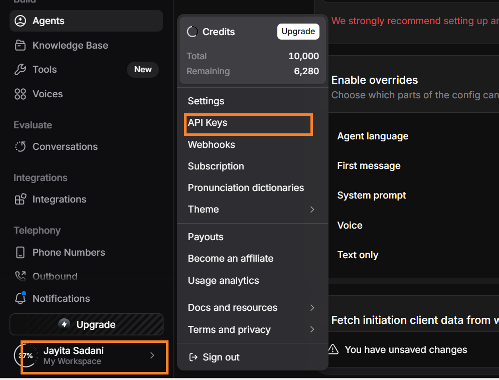

# 🎙️ Voice Assistant with ElevenLabs Conversational AI API

This project demonstrates how to create a **real-time voice assistant** using the [ElevenLabs Conversational AI API](https://elevenlabs.io/).  

The assistant:
- 🎤 Records your voice through the microphone  
- 🖨️ Detects when you finish speaking or interrupt the assistant  
- 🤖 Uses an LLM to generate responses  
- 📈 Synthesizes speech from the response  
- 🔊 Plays the generated speech back through your speakers  

---

## 📦 Features
- Real-time speech recognition  
- Smart voice activity detection (VAD)  
- AI-powered conversational responses  
- Natural, high-quality voice synthesis  
- Instant playback  

---

## 🛠 Architecture

```text
 🎤 Microphone Input
        ↓
 [Voice Activity Detection] --- detects when you finish speaking
        ↓
 [Speech-to-Text] --- converts voice to text
        ↓
 [LLM API Call] --- generates AI response
        ↓
 [Text-to-Speech] --- synthesizes natural voice
        ↓
 🔊 Speaker Output
```

---

## 🚀 Setup Instructions

### 1️⃣ Install Python
Make sure [Python 3.10+](https://www.python.org/downloads/) is installed.

### 2️⃣ Clone the repository

```text
git clone https://github.com/JayitaSd/Voice_Assistant.git
cd Voice_Assistant
```

### 3️⃣ Install Required Python Packages

```text
pip install elevenlabs elevenlabs[pyaudio] python-dotenv
```

### 4️⃣ Install PortAudio (Required by PyAudio)

Processing the audio requires additional dedpendencies on Linux, MacOS and Windows
- For Linux, you will need to install [portaudio19](https://packages.debian.org/sid/portaudio19-dev )
    
  ```text
  sudo apt update
  sudo apt install portaudio19-dev
  ```

- For MacOs, you will need to install [portaudio](https://www.portaudio.com/)

  ```text
  brew install portaudio
  ```

- For Windows, you will need to install [PyAudio](https://pypi.org/project/PyAudio/)

  ```text
  pip install pyaudio
  ```
    
### 5️⃣ Setting Up Eleven Labs

1. Sign up at [ElevenLabs](https://elevenlabs.io/app/sign-up) and follow the instructions to create an account.

2. Once signed in, go to "Conversational AI"

<p align="center">
  
</p>

3. Go to "Agents"

<p align="center">
  
</p>

4. Click on "Start from blank"

<p align="center">
  
</p>

5. Create a ".env" file at the root of your project folder. We will use this file to store our API credentials securely. This way they won't be hardcoded in the script. In this ".env" file, add your Agent ID:

<p align="center">
  
</p>

```bash
AGENT_ID=your_agent_id
```

6. Go to the "Security" tab under your created agent, enable the "First message" and "System prompt" overrides, and save. This will allow us to customize the assistant's first message and system prompt using Python code.

<p align="center">
  
</p>

7. Click on your profile and go to "API keys". Create a new API key and copy it to your ".env" file:

```bash
API_KEY="sk_XXX...XXX"
```

**Please make sure to save your ".env" file after adding the credentials.**

<p align="center">
  
</p>

ElevenLabs is now set up and ready to be used in our Python script!

**Note:** ElevenLabs works with a credit system. When you sign up, you get 10,000 free credits which amount to 15 minutes of conversation. You can buy more credits if needed.


---

## ▶️ Running the Voice Assistant

